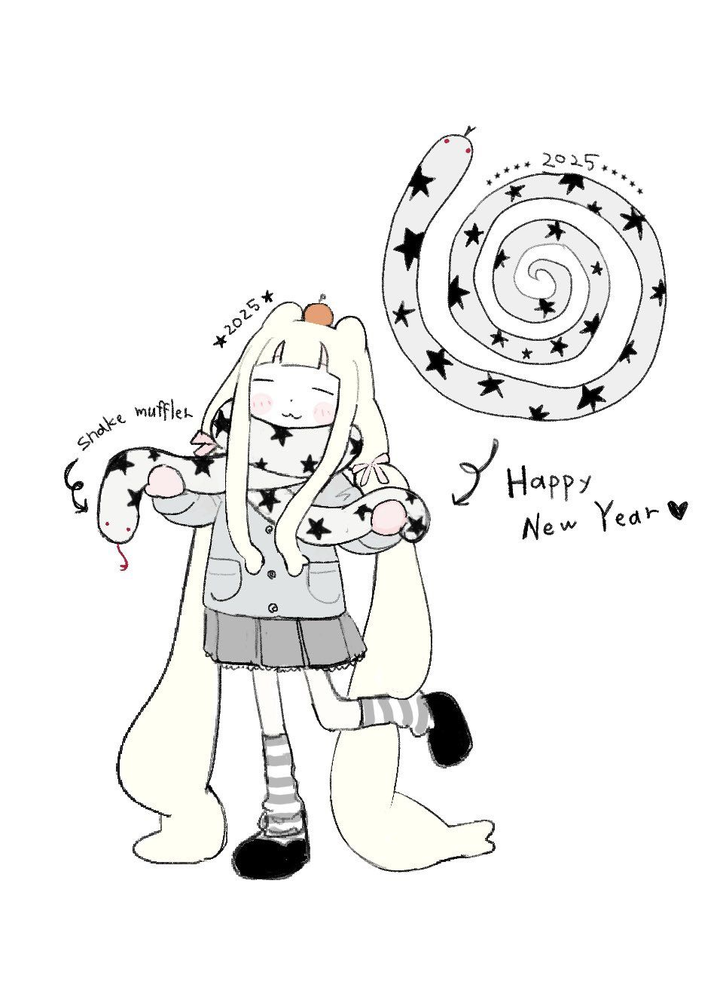
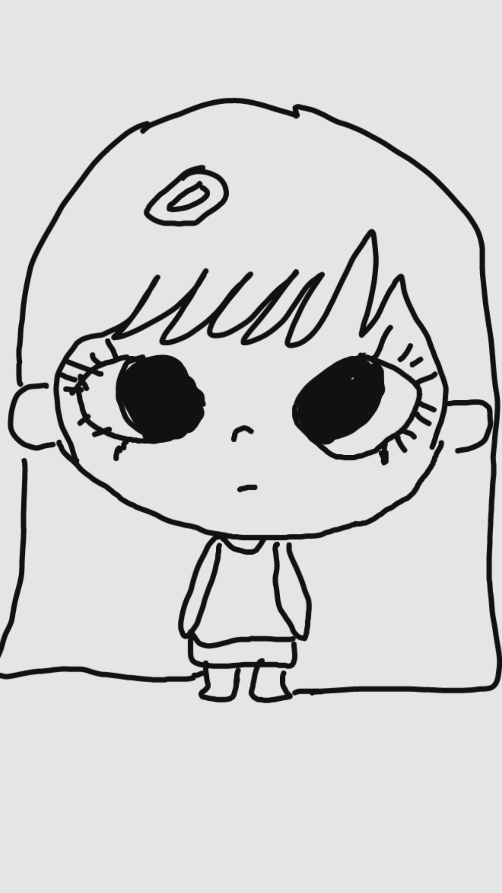

# Pixel Figure Illustration Skill｜像素小人配图 Skill

把文章、口播稿、笔记、产品体验、AI 新闻或个人观点，拆成适合小红书发布的 **3:4 手绘叙事内容图**。

它不是“把文字塞进知识卡片”，而是让文字与人物动作共同讲故事：一页只讲一个核心意思，宁可多一页，也不缩字堆信息。

> 名称中的 “Pixel Figure / 像素小人” 是角色昵称，不代表 Pixel Art 像素画风。

## 视觉风格

### Black Ink + Soft Accent Color

纯白背景、黑色手绘线稿和黑色文字；最多加入 1–2 种低饱和辅助色，着色面积不超过约 15–20%。颜色只用来点重点、区分人物或增加生活感。

### Denim Blue Line Art

纯白背景与单一牛仔蓝线稿，保留大量留白。这里的 Denim 指蓝色墨水与线条质感，不是西部牛仔主题：禁止牛仔帽、马、沙漠、仙人掌、棕色和米白复古纸张。

## 2-Part / 3-Part / 4-Part

| 模式 | 适用内容 | 每部分字数 | 单图总字数 |
|---|---|---:|---:|
| 2-Part | 强观点、转折、开场、结尾 | 15–30 | 35–60 |
| 3-Part | 开始 → 变化 → 结果，默认模式 | 12–25 | 40–70 |
| 4-Part | 确实存在四个连续节奏或步骤 | 8–20 | 45–75 |

“Part” 是内容节奏，不是平均分栏。任何模式建议不超过 90 个中文字；超过时拆成下一页，不缩小字号。

## 示例效果

### 用户授权的 IP 母版



### 基于该 IP 的生成式角色效果图



完整的 3-Part 页面策划示例见 [`examples/claude-3-part.md`](examples/claude-3-part.md)。仓库未收录讨论过程中使用的第三方排版或风格参考图。

## 安装

### Codex

将仓库克隆到 Codex Skills 目录：

```bash
git clone https://github.com/<your-account>/pixel-figure-illustration-skill.git ~/.codex/skills/pixel-figure-illustration-skill
```

重新打开 Codex 会话后，可以直接说：

```text
用 pixel-figure-illustration 把这篇文章拆成 6 张小红书内容图，使用 Black Ink + Soft Accent Color，默认 3-Part。
```

也可以显式指定：

```text
用这个 Skill 做一张 2-Part 收尾页，切成 Denim Blue Line Art。
```

在其他支持 `SKILL.md` 的 Agent 环境中，把整个目录复制到对应 Skills 目录即可。

## 使用方式

建议输入包括：

- 原文或主题
- 想生成的页数（可选）
- 视觉风格（不指定时由 Agent 判断）
- Part 模式（不指定时默认优先 3-Part）
- 是否需要沿用自己的角色母版

Skill 会先建立逐页 Page Beat，再生成插画层，最后通过 HTML / SVG / Canvas 等方式准确排版中文。长中文不交给生图模型直接书写。

## 目录结构

```text
pixel-figure-illustration-skill/
├── SKILL.md
├── README.md
├── LICENSE
├── .gitignore
├── assets/
│   ├── ip-reference/
│   │   └── canonical-ip.png
│   └── examples/
│       └── generated-character-study.png
└── examples/
    └── claude-3-part.md
```

## 注意事项

- `assets/ip-reference/canonical-ip.png` 是当前项目的唯一人物基准；换动作、表情和场景，不换人物。
- 默认输出 3:4（推荐 1242 × 1660 或等比例高清尺寸）。
- 文字与插画共同构图，避免 PPT、知识卡片、固定左文右图、卡片分栏和模板化九宫格。
- 一页最多两个主要场景，优先画人物正在做什么，而不是堆 icon。
- 开源许可不等于第三方素材许可。向仓库加入图片前，请确认你拥有版权或明确授权。
- 示例中的产品名仅用于演示内容拆分方式，不代表相关公司对本项目的认可或合作。

## English summary

This Skill turns long-form content into 3:4 Xiaohongshu narrative illustrations with a consistent character IP, accurate layered Chinese typography, abundant white space, and flexible 2-Part, 3-Part, or 4-Part pacing. It supports two art directions: **Black Ink + Soft Accent Color** and **Denim Blue Line Art**. Read [`SKILL.md`](SKILL.md) for the complete operating rules.

## License

MIT. See [`LICENSE`](LICENSE).
